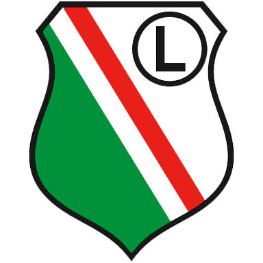

## FISHEYE-MENU by [@Wasiak](https://github.com/Wasiak) ##

Interface with icons geting bigger when cursor is closer to icon horizontal center point
### [DEMO](http://wasiak.github.io/Fisheye-menu/) ###


Pure JS, no jQuery.

Add class '.fisheye-menu' to ul with images in li's

```html
<ul class='fisheye-menu'>
    <li>
      <a href=''>
        
      </a>
    </li>
    ...
</ul>    
```

Run a function and enjoy your fisheye menu.
Possibility to set your own icon grow ratio and limit of icon reaction.

```javascript
fisheyeMenu({
	growRatio: 1.8,
    verticalLimit: 10,
    horizontalLimit: 1.5
});
```
setable options: 
- growRatio - ratio of new size to default
- verticalLimit - vertical limit of icon reaction [px]
- horizontalLimit - horizontal limit of reaction by single icon [icon.width ratio]


Efect with custom options:
- growRatio: 2.8,
- horizontalLimit: 2.5
